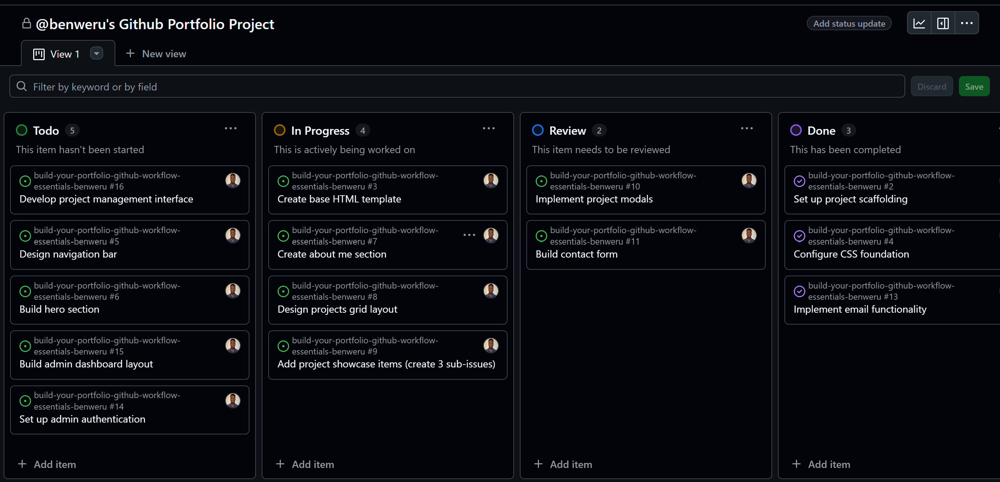
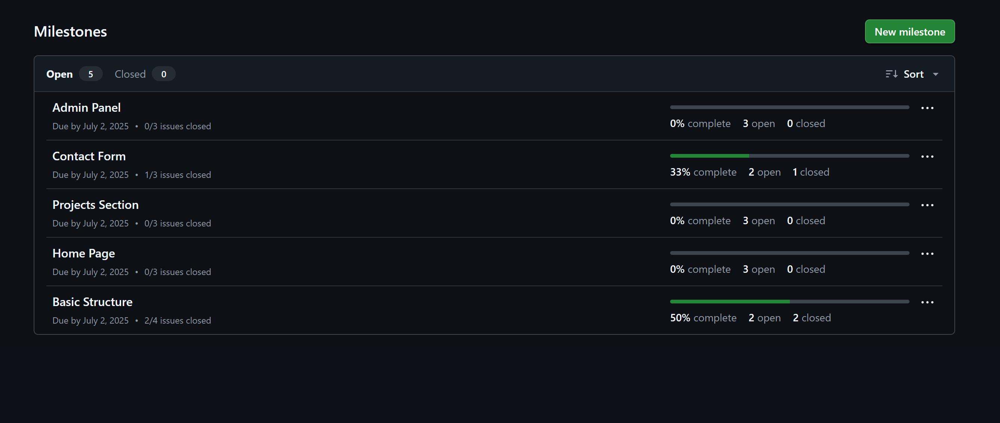
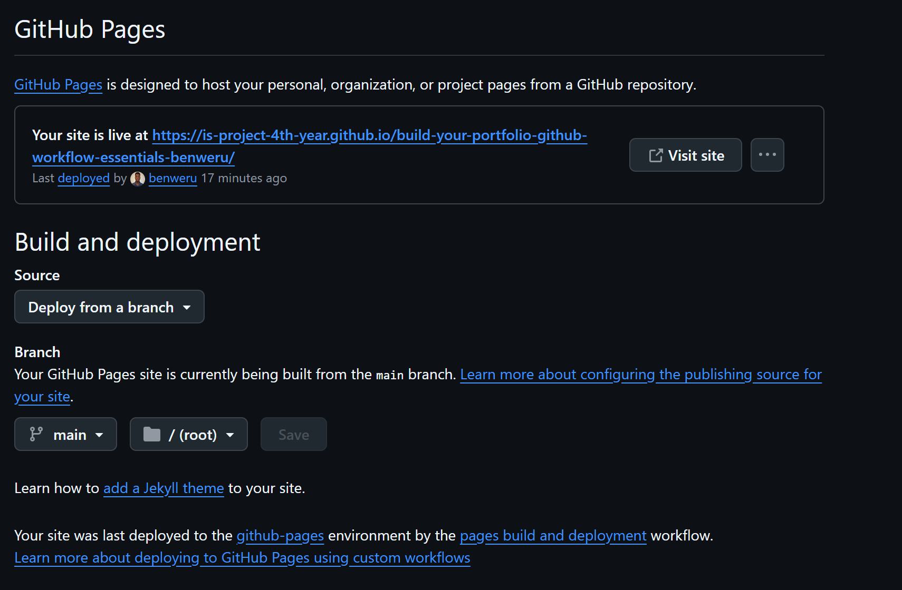
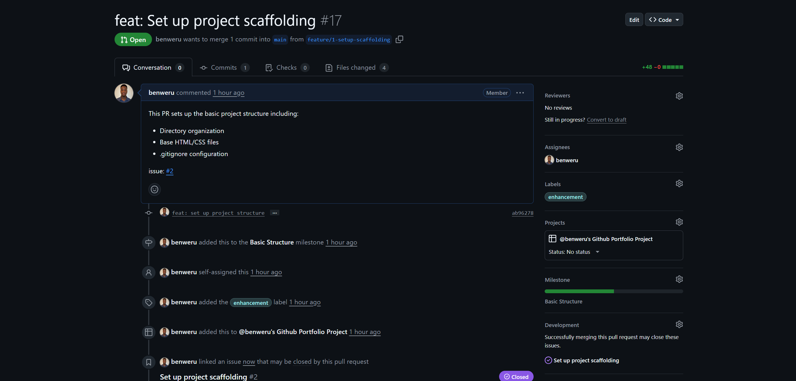

# Personal Portfolio Project Submission

## Project Management Evidence




_GitHub project board showing progress_

## Branching Strategy

Used feature branches following `feature/<issue-number>-description` pattern:

```bash
git checkout -b feature/1-setup-scaffolding
```

## Commit Message Examples

```
feat(navbar): add responsive navigation
docs: update README with installation instructions
fix(contact): repair form validation
```

## Pull Request Evidence


_Caption: PR showing review and linked issues_

## Conflict Resolution

Simulated conflict between:

- feature/2-navbar (added navigation)
- feature/3-hero-section (updated header text)

Resolved by keeping both changes in header section.

## Deployment

- **GitHub Pages URL**: https://is-project-4th-year.github.io/build-your-portfolio-github-workflow-essentials-benweru/
- **Additional Deployment**: N/A

## Checklist Verification

- [✅] Applied branch protection rules
- [✅] Defined 5 milestones with issues
- [✅] Project board used throughout
- [✅] 8+ structured commits with varied types
- [✅] Feature branches for all work
- [✅] PRs with descriptions and linked issues
- [✅] Demonstrated conflict resolution
- [✅] Deployed to GitHub Pages
- [✅] Completed Assignment.md
